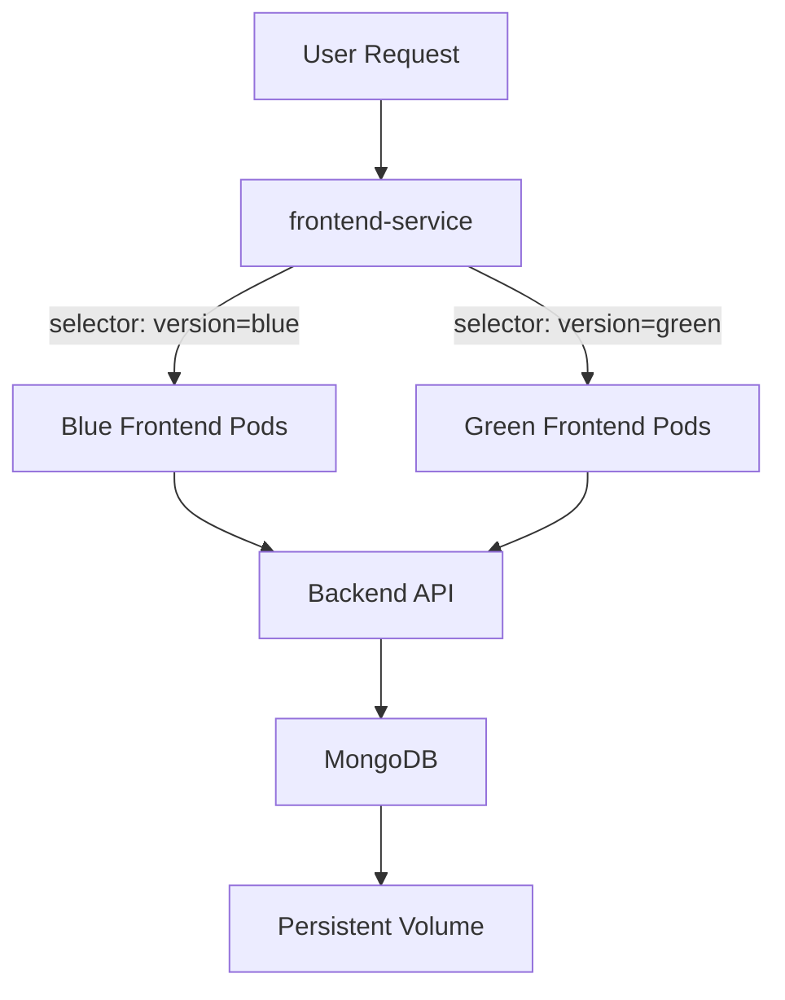

# Blue-Green Deployment Project
---

## 🎯 Project Overview

This project demonstrates a complete **blue-green deployment** implementation using modern DevOps practices. It includes a full-stack application with two frontend versions that can be switched seamlessly with zero downtime.

### Application Components:

1. **Backend API** (Node.js + Express + MongoDB)
   - RESTful API for user registration
   - MongoDB integration for data persistence
   - Health check endpoints
   - User statistics endpoints

2. **Frontend Blue** (Basic Version)
   - Simple single-page registration form
   - Clean and minimalist UI
   - Direct user registration
   - Basic styling

3. **Frontend Green** (Enhanced Version)
   - Multi-step registration form
   - Progress indicator
   - Interactive tag inputs for interests and languages
   - Enhanced UX with animations
   - Modern gradient styling

---

## ✨ Features

- **Zero-Downtime Deployment**: Seamless switching between versions
- **Easy Rollback**: Instant revert to previous version if issues occur
- **Containerization**: Full Docker support for all components
- **Orchestration**: Kubernetes deployment with Minikube
- **Health Checks**: Liveness and readiness probes
- **Persistent Storage**: MongoDB with Persistent Volume Claims
- **Scalability**: Multiple replicas for high availability
- **Load Balancing**: Service-based traffic distribution

---

## 🏗️ Architecture

```
┌─────────────────────────────────────────────┐
│         Load Balancer Service               │
│         (frontend-service)                  │
└──────────────┬──────────────────────────────┘
               │
       ┌───────┴────────┐
       │                │
   ┌───▼────┐      ┌────▼───┐
   │ Blue   │      │ Green  │
   │ Basic  │      │Enhanced│
   │ v1.0   │      │ v2.0   │
   │(2 pods)│      │(2 pods)│
   └───┬────┘      └────┬───┘
       │                │
       └────────┬───────┘
                │
         ┌──────▼──────┐
         │   Backend   │
         │   API       │
         │   (2 pods)  │
         └──────┬──────┘
                │
         ┌──────▼──────┐
         │   MongoDB   │
         │   (1 pod)   │
         │   + PVC     │
         └─────────────┘
```

### Flow Diagram



---

## 🔧 Prerequisites

Before starting, ensure you have the following installed:

- **Git**: Version control
- **Node.js**: v18+ and npm
- **Docker Desktop**: For containerization
- **Minikube**: Local Kubernetes cluster
- **kubectl**: Kubernetes CLI tool
- **Docker Hub Account**: For pushing images

### Verify Installations

```bash
# Check Node.js
node --version   # Should be v18+
npm --version

# Check Docker
docker --version
docker-compose --version

# Check Minikube
minikube version

# Check kubectl
kubectl version --client
```

---

## 📁 Project Structure

```
blue-green-project/
├── backend/
│   ├── models/
│   │   └── user.js              # MongoDB User model
│   ├── routes/
│   │   └── users.js             # User API routes
│   ├── server.js                # Express server
│   ├── package.json             # Backend dependencies
│   ├── Dockerfile               # Backend Docker image
│   └── .env                     # Environment variables
│
├── frontend-blue/
│   ├── public/
│   │   ├── index.html           # Basic registration form
│   │   └── styles.css           # Basic UI styles
│   ├── server.js                # Express static server
│   ├── package.json             # Frontend dependencies
│   ├── Dockerfile               # Blue frontend Docker image
│   └── .env                     # Environment variables
│
├── frontend-green/
│   ├── public/
│   │   ├── index.html           # Enhanced multi-step form
│   │   ├── styles.css           # Enhanced UI styles
│   │   └── app.js               # Frontend JavaScript logic
│   ├── server.js                # Express static server
│   ├── package.json             # Frontend dependencies
│   ├── Dockerfile               # Green frontend Docker image
│   └── .env                     # Environment variables
│
├── k8s/
│   ├── mongodb-deployment.yaml  # MongoDB deployment + PVC
│   ├── backend-deployment.yaml  # Backend API deployment
│   ├── frontend-blue-deployment.yaml
│   ├── frontend-green-deployment.yaml
│   ├── frontend-service.yaml    # LoadBalancer service
│   └── ingress.yaml             # Ingress configuration
│
├── docker-compose.yml           # Docker Compose configuration
├── .gitignore                   # Git ignore rules
└── README.md                    # This file
```

---

## 🚀 Setup Instructions

### Part 1: Local Deployment

#### Step 1: Clone the Repository

```bash
git clone <your-repository-url>
cd blue-green-project
```

#### Step 2: Start MongoDB

**Using Docker (Recommended):**
```bash
docker run -d \
  --name mongodb \
  -p 27017:27017 \
  -e MONGO_INITDB_DATABASE=registration \
  mongo:6.0
```

**Or use local MongoDB installation**

#### Step 3: Setup Backend

```bash
cd backend
npm install

# Create .env file
cat > .env << EOF
PORT=5000
MONGO_URI=mongodb://localhost:27017/registration
EOF

# Start backend
npm start
```

**Expected Output:**
```
Backend server running on port 5000
MongoDB connected
```

**Verify:**
```bash
curl http://localhost:5000/health
# Response: {"status":"ok","message":"Backend API is running"}
```

#### Step 4: Setup Blue Frontend

```bash
cd frontend-blue
npm install

# Create .env file
echo "PORT=3100" > .env

# Start blue frontend
npm start
```

**Access:** http://localhost:3100

#### Step 5: Setup Green Frontend

```bash
cd frontend-green
npm install

# Create .env file
echo "PORT=3200" > .env

# Start green frontend
npm start
```

**Access:** http://localhost:3200

#### Step 6: Test Local Deployment

1. Open http://localhost:3100 (Blue - Basic UI)
2. Register a test user
3. Open http://localhost:3200 (Green - Enhanced UI)
4. Register another test user
5. Verify both registrations:
   ```bash
   curl http://localhost:5000/api/users
   ```

---

### Part 2: Docker Containerization

#### Step 1: Stop Local Services

Stop all running npm processes (Ctrl+C in each terminal)

#### Step 2: Build Docker Images

**Replace `your-dockerhub-username` with your Docker Hub username!**

```bash
# Login to Docker Hub
docker login

# Build images
docker build -t your-dockerhub-username/backend:v1 ./backend
docker build -t your-dockerhub-username/frontend-blue:v1 ./frontend-blue
docker build -t your-dockerhub-username/frontend-green:v1 ./frontend-green

# Push to Docker Hub
docker push your-dockerhub-username/backend:v1
docker push your-dockerhub-username/frontend-blue:v1
docker push your-dockerhub-username/frontend-green:v1
```

#### Step 3: Run with Docker Compose

```bash
# Start all services
docker-compose up -d

# Check status
docker-compose ps
```

**Expected Output:**
```
NAME              STATUS              PORTS
mongodb          running             27017->27017
backend          running (healthy)   5000->5000
frontend-blue    running             3100->3100
frontend-green   running             3200->3200
```

#### Step 4: Test Docker Deployment

```bash
# Test backend
curl http://localhost:5000/health

# Access frontends
# Blue: http://localhost:3100
# Green: http://localhost:3200

# View logs
docker-compose logs -f
```

#### Step 5: Cleanup Docker Compose

```bash
docker-compose down
```

---

### Part 3: Kubernetes Deployment

#### Step 1: Start Minikube

```bash
# Start Minikube cluster
minikube start --driver=docker --memory=4096 --cpus=2

# Enable addons
minikube addons enable metrics-server
minikube addons enable ingress

# Verify cluster
kubectl cluster-info
kubectl get nodes
```

#### Step 2: Update Kubernetes Manifests

**IMPORTANT:** Edit all deployment YAML files in `k8s/` directory and replace `your-dockerhub-username` with your actual Docker Hub username.

**Quick update using sed (Linux/Mac):**
```bash
sed -i '' 's/your-dockerhub-username/YOUR_USERNAME/g' k8s/*.yaml
```

**Or manually edit:**
- `k8s/backend-deployment.yaml`
- `k8s/frontend-blue-deployment.yaml`
- `k8s/frontend-green-deployment.yaml`

#### Step 3: Deploy to Kubernetes

```bash
# Apply all manifests
kubectl apply -f k8s/

# Verify deployments
kubectl get deployments
```

**Expected Output:**
```
NAME              READY   UP-TO-DATE   AVAILABLE   AGE
backend           2/2     2            2           1m
frontend-blue     2/2     2            2           1m
frontend-green    2/2     2            2           1m
mongodb           1/1     1            1           1m
```

#### Step 4: Check Pod Status

```bash
# View all pods
kubectl get pods

# All pods should show STATUS: Running and READY: 1/1 or 2/2
```

#### Step 5: Access the Application

```bash
# Get service URL
minikube service frontend-service --url

# Example output: http://192.168.49.2:30123
# Open this URL in your browser
```

**Alternative method:**
```bash
# Port forward to localhost
kubectl port-forward service/frontend-service 8080:80

# Access: http://localhost:8080
```

---

### Part 4: Blue-Green Deployment

#### Initial State (Blue Active)

```bash
# Verify current version
kubectl describe service frontend-service | grep -A 5 Selector

# Output should show:
# Selector: app=frontend,version=blue
```

The service initially routes to **Blue (Basic UI)** frontend.

#### Switch to Green (Enhanced UI)

```bash
# Switch traffic to Green version
kubectl patch service frontend-service --type='merge' -p '{
  "spec":{
    "selector":{"app":"frontend","version":"green"},
    "ports":[{"port":80,"targetPort":3200,"protocol":"TCP"}]
  }
}'
```

**Verify the switch:**
```bash
# Check service selector
kubectl describe service frontend-service | grep -A 5 Selector
# Should now show: version=green

# Check endpoints
kubectl get endpoints frontend-service
# Should point to green pods
```

**Access the application** - Should now show **Enhanced UI** with multi-step form!

#### Switch Back to Blue (Rollback)

```bash
# Rollback to Blue version
kubectl patch service frontend-service --type='merge' -p '{
  "spec":{
    "selector":{"app":"frontend","version":"blue"},
    "ports":[{"port":80,"targetPort":3100,"protocol":"TCP"}]
  }
}'
```

#### Verify Zero Downtime

Both blue and green deployments run simultaneously. Switching only updates the service selector, providing **instant traffic redirection** with **zero downtime**.

---

## 🔄 Blue-Green Deployment Strategy

### Overview

Blue-green deployment is a release management strategy that reduces downtime and risk by running two identical production environments.

### Implementation Details

1. **Two Environments**:
   - **Blue**: Current production version (Basic UI)
   - **Green**: New version (Enhanced UI)

2. **Service Selector**:
   - Uses Kubernetes labels (`version: blue` or `version: green`)
   - Service selector determines which pods receive traffic
   - Both deployments run simultaneously

3. **Switching Process**:
   - Deploy new version (green) alongside current (blue)
   - Validate green deployment is healthy
   - Update service selector to point to green
   - Monitor green version
   - Keep blue as rollback option

4. **Rollback Strategy**:
   - Instant rollback by reverting service selector
   - No need to redeploy
   - Blue environment preserved for quick recovery

### Advantages

✅ **Zero Downtime**: Traffic switches instantly  
✅ **Easy Rollback**: Single command to revert  
✅ **Testing in Production**: Validate before switching  
✅ **Risk Mitigation**: Previous version available as backup  
✅ **Simple Implementation**: Using Kubernetes labels and selectors  

### Commands Reference

```bash
# Check current version
kubectl get service frontend-service -o jsonpath='{.spec.selector.version}'

# Switch to Green
kubectl patch service frontend-service --type='merge' -p '{
  "spec":{
    "selector":{"app":"frontend","version":"green"},
    "ports":[{"port":80,"targetPort":3200,"protocol":"TCP"}]
  }
}'

# Switch to Blue
kubectl patch service frontend-service --type='merge' -p '{
  "spec":{
    "selector":{"app":"frontend","version":"blue"},
    "ports":[{"port":80,"targetPort":3100,"protocol":"TCP"}]
  }
}'
```

---

---

## 🔧 Troubleshooting

### Common Issues

#### 1. Pods Not Starting

```bash
# Check pod status
kubectl get pods

# Describe pod for events
kubectl describe pod <pod-name>

# View pod logs
kubectl logs <pod-name>
```

**Common causes:**
- ImagePullBackOff: Wrong image name or not on Docker Hub
- CrashLoopBackOff: Application error, check logs
- Pending: Insufficient resources

#### 2. Cannot Access Application

```bash
# Check service
kubectl get service frontend-service

# Get Minikube IP
minikube ip

# Get service URL
minikube service frontend-service --url

# Port forward as alternative
kubectl port-forward service/frontend-service 8080:80
```

#### 3. MongoDB Connection Failed

```bash
# Check MongoDB pod
kubectl get pods -l app=mongodb

# Check MongoDB logs
kubectl logs deployment/mongodb

# Check backend logs
kubectl logs deployment/backend

# Verify service exists
kubectl get service mongodb
```

#### 4. Blue-Green Switch Not Working

```bash
# Verify selector changed
kubectl get service frontend-service -o yaml | grep -A 5 selector

# Check endpoints
kubectl get endpoints frontend-service

# Verify pods are ready
kubectl get pods -l app=frontend

# Clear browser cache and refresh
```

### Debug Commands

```bash
# Get all resources
kubectl get all

# Check events
kubectl get events --sort-by=.metadata.creationTimestamp

# Check resource usage
kubectl top nodes
kubectl top pods

# Execute commands in pod
kubectl exec -it <pod-name> -- sh

# Port forward for testing
kubectl port-forward deployment/backend 5000:5000
```

---

## 💡 Challenges and Solutions

### Challenge 1: MongoDB Connectivity in Containers

**Problem:** Backend couldn't connect to MongoDB using `localhost`

**Solution:** 
- Used Kubernetes DNS: `mongodb://mongodb:27017/registration`
- Service name resolves to ClusterIP automatically
- Works across container networking

### Challenge 2: Image Pull Errors

**Problem:** `ImagePullBackOff` errors in Kubernetes

**Solution:**
- Ensured Docker images were pushed to Docker Hub
- Verified image names match exactly in YAML files
- Made images public or used image pull secrets

### Challenge 3: Health Check Failures

**Problem:** Pods restarting due to failed health checks

**Solution:**
- Increased `initialDelaySeconds` to allow app startup
- Added proper `/health` endpoints in all services
- Adjusted timeout values appropriately

### Challenge 4: Service Selector Update

**Problem:** Traffic not switching during blue-green deployment

**Solution:**
- Updated both `selector` AND `targetPort` in service
- Ensured pod labels match service selectors exactly
- Verified endpoints change after selector update

### Challenge 5: Data Persistence

**Problem:** Data lost when MongoDB pod restarted

**Solution:**
- Created PersistentVolumeClaim for MongoDB
- Mounted volume to `/data/db`
- Data now persists across pod restarts

---

## 📸 Screenshots

### Local Deployment
- Terminal showing all 3 services running
- Browser showing Blue frontend at http://localhost:3100
- Browser showing Green frontend at http://localhost:3200
- Successful user registration

### Docker Deployment
- `docker-compose ps` showing all containers running and healthy
- `docker images` showing built images
- Application accessible via Docker containers

### Kubernetes Deployment
- `kubectl get all` showing all resources
- `kubectl get pods` showing all pods in Running state
- `kubectl get deployments` showing 2/2 ready for all deployments
- Application accessible via Minikube service URL

### Blue-Green Deployment
- Initial state showing Blue version active
- Service description showing `version: blue` selector
- Browser showing Basic UI (Blue)
- Command execution switching to Green
- Service description showing `version: green` selector
- Browser showing Enhanced UI (Green)
- Rollback demonstration

---

## 🧹 Cleanup

### Stop All Services

```bash
# Delete Kubernetes resources
kubectl delete -f k8s/

# Stop Minikube
minikube stop

# Optional: Delete Minikube cluster
minikube delete

# Stop Docker Compose (if running)
docker-compose down -v

# Remove Docker containers
docker stop mongodb
docker rm mongodb
```

### Remove Docker Images (Optional)

```bash
docker rmi your-dockerhub-username/backend:v1
docker rmi your-dockerhub-username/frontend-blue:v1
docker rmi your-dockerhub-username/frontend-green:v1
```

---

## 📚 Additional Resources

- [Kubernetes Documentation](https://kubernetes.io/docs/)
- [Docker Documentation](https://docs.docker.com/)
- [Blue-Green Deployment Pattern](https://martinfowler.com/bliki/BlueGreenDeployment.html)
- [Minikube Documentation](https://minikube.sigs.k8s.io/docs/)
- [Express.js Guide](https://expressjs.com/)
- [MongoDB Documentation](https://docs.mongodb.com/)

---


---

**Thank you for reviewing this project! 🚀**
